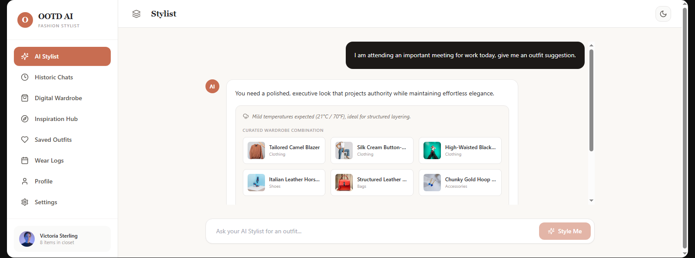
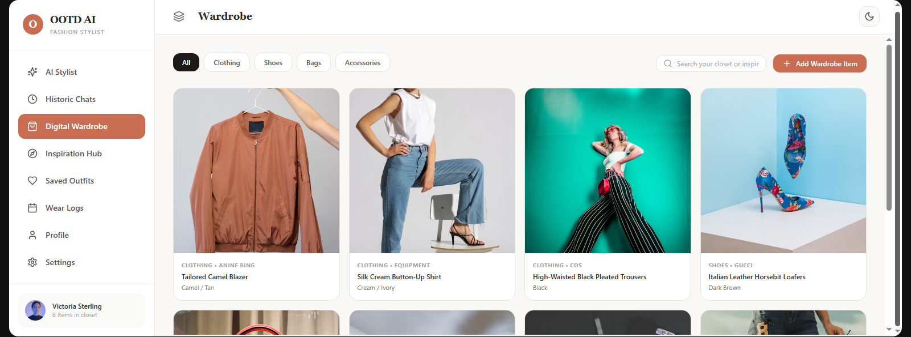
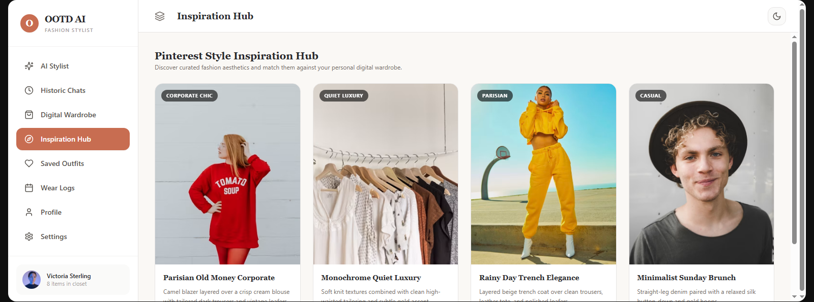
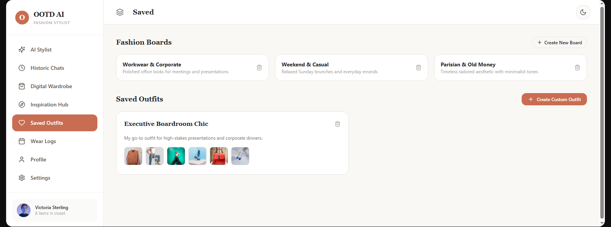
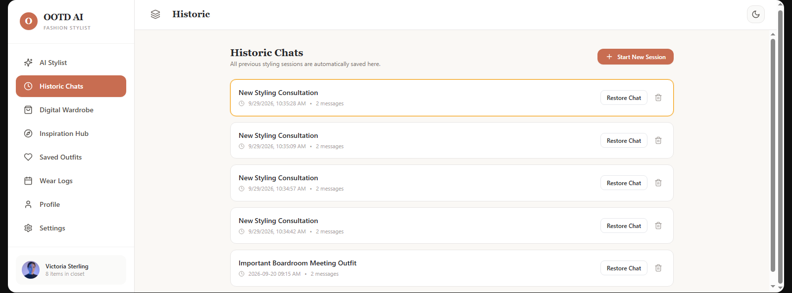
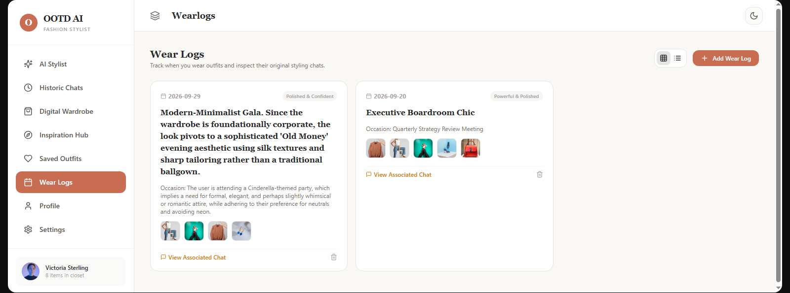
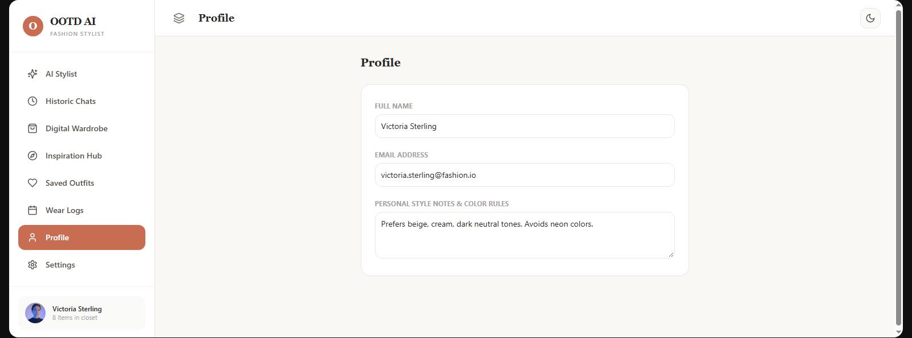
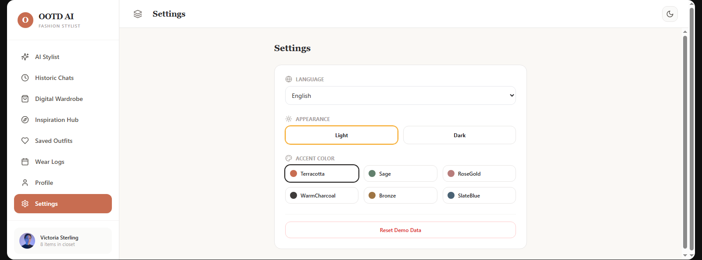

# OOTD AI Wardrobe Stylist

An AI-powered fashion styling and digital wardrobe application designed to help users discover personalised outfit ideas using their existing wardrobe, contextual information, and generative AI.

---

## Project Overview

The **AI Wardrobe Stylist** is a group-developed project that explores how generative AI and prompt engineering can be applied to an everyday problem: deciding what to wear.

The application combines an AI fashion stylist with a digital wardrobe and personal fashion organisation features. Rather than simply suggesting random clothing combinations, the project aims to understand the user's request, interpret the occasion and desired aesthetic, and match recommendations against the user's actual wardrobe.

The project began as a partially completed prototype and was enhanced with a focus on functionality, contextual AI reasoning, persistence, user experience, and connected wardrobe management.

---

## Problem Statement

Choosing an outfit can involve several factors, including:

- The occasion
- Dress code and formality
- Weather
- Personal style
- Colour combinations
- Comfort
- Available clothing

Generic fashion recommendations may not reflect what a person actually owns.

The **AI Wardrobe Stylist** aims to address this by providing a more personalised experience where users can describe what they need naturally and receive recommendations based on their own wardrobe and the context of their request.

---

## Project Objectives

The project aims to:

- Provide personalised AI-powered outfit recommendations.
- Allow users to organise their clothing digitally.
- Understand natural-language styling requests.
- Consider occasion, mood, aesthetic, formality and practical context.
- Match recommendations against the user's existing wardrobe.
- Provide fashion inspiration connected to the user's wardrobe.
- Allow users to save and organise outfits.
- Maintain styling conversations and outfit history.
- Demonstrate practical applications of generative AI and prompt engineering.

---

## Key Features

### AI Stylist

A conversational AI stylist that allows users to describe what they want naturally.

Examples include:

> "I have an important work meeting tomorrow."

> "I want something elegant for dinner."

> "Give me a casual Sunday brunch outfit."

> "I want a Parisian look using what I already own."

The AI is designed to interpret contextual information rather than requiring users to complete a rigid questionnaire.

---

### Digital Wardrobe

Users can maintain a digital representation of the clothing and accessories they own.

Wardrobe information can include:

- Item name
- Category
- Colour
- Brand
- Style
- Occasion
- Formality
- Season
- Material
- Silhouette

The wardrobe acts as an important source of information when generating outfit recommendations.

---

### Historic Chats

Styling conversations can be retained so users can return to previous recommendations.

Users can:

- Open conversations
- Continue conversations
- Rename conversations
- Update conversations
- Delete conversations

This allows the AI stylist to maintain context within an ongoing styling experience.

---

### Inspiration Hub

The application incorporates fashion inspiration to help users explore different aesthetics and styling ideas.

Examples include:

- Corporate Chic
- Quiet Luxury
- Minimalist
- Parisian
- Romantic
- Streetwear
- Smart Casual
- Evening
- Vacation

The goal is to connect inspiration with the user's actual wardrobe rather than treating inspiration as a separate image gallery.

---

### Saved Outfits

Users can save outfit combinations for future reference.

Saved outfits can form part of the user's personal fashion inspiration collection.

---

### Boards

The application supports a Pinterest-inspired organisation concept where users can organise saved outfits into themed boards.

Examples include:

- Workwear
- Date Night
- Weekend
- Summer
- Winter
- Minimalist
- Wedding Guest
- Favourite Looks

---

### Wear Logs

Users can record outfits they have worn.

Where applicable, a wear-log entry can be connected to the styling conversation that produced the outfit.

This creates a connection between:

**AI Stylist → Outfit → Wear Log → Chat History**

---

### Profile & Settings

The application separates personal profile information from application settings.

Settings include concepts such as:

- Language
- Appearance
- Accent colour

---

## AI & Prompt Engineering

Generative AI is central to the project.

Prompt engineering was used to guide the AI toward more contextual and conversational behaviour.

Instead of relying only on explicit keywords, the stylist is designed to interpret requests such as:

> "I want to look powerful but not overdressed."

The system can interpret this as a combination of:

- Professional context
- Higher formality
- Confidence
- Controlled styling
- Avoiding excessive formality

### Conversational Refinement

The project also emphasises conversational refinement.

For example:

**User:**

> "I need something for work."

**AI:**

Asks an appropriate follow-up question if additional context is required.

**User:**

> "It's tomorrow."

The AI should understand that the user is referring to the previously discussed work occasion.

**User:**

> "Make it more feminine."

The AI should modify the existing recommendation rather than treating the request as a completely new conversation.

---

## Wardrobe-First Intelligence

A key design principle of the project is that recommendations should be grounded in the user's actual wardrobe.

The system is intended to consider:

- Colour compatibility
- Occasion
- Formality
- Style
- Silhouette
- Weather
- Practicality
- Footwear
- Accessories
- Layering

If the wardrobe cannot produce a suitable complete outfit, the application should identify the missing item rather than inventing one or returning an unrelated combination.

---

## Inspiration-to-Wardrobe Matching

The intended styling workflow is:

```text
User Request
     ↓
Interpret Intent
     ↓
Find Relevant Inspiration
     ↓
Understand the Inspiration
     ↓
Match Against User's Wardrobe
     ↓
Evaluate Compatibility
     ↓
Explain the Recommendation
     ↓
  Save / Modify / Wear / Add to Board
  ```
This creates a connection between fashion inspiration and the user's real wardrobe.

 ---

## Tools & Technologies
The project made use of:

Generative AI
Prompt Engineering
Gemini
ChatGPT
AI-assisted development
Web application technologies

The project focuses particularly on the practical use of generative AI and prompt engineering to create an interactive product experience.

## Development Approach

The project was developed from an existing partially completed prototype rather than being created from scratch.

The development approach focused on:

Understanding the existing application.
Identifying incomplete and disconnected functionality.
Improving application state and persistence.
Enhancing AI reasoning.
Connecting the wardrobe with recommendations.
Improving inspiration and outfit discovery.
Connecting chats, outfits and wear logs.
Improving usability and accessibility.
Testing user-facing functionality.
Refining the overall product experience.

## Group Project

This was developed as a collaborative group project.

The project involved collaboration around:

Product functionality
Generative AI
Prompt engineering
User experience
Feature development
Testing and refinement

Individual contributions should be documented separately according to each group member's actual responsibilities.

## Project Documentation

Detailed project documentation covering the project objectives, functionality, AI approach, development process, testing requirements and future improvements is included in this repository. 

### Full Project Documentation

[Download the Full Project Documentation](OOTD_AI_Wardrobe_Stylist_Project_Documentation.pdf)


## Project Links

### Live AI Wardrobe Stylist

[Open the AI Wardrobe Stylist](https://gemini.google.com/share/bfb8b44fc16a?skid=f0551d75-2f91-4471-bc0f-d478a1a0c7d7)

### Portfolio

[View Khensani Ntombela's Portfolio](https://khensanintombela.github.io/My-Portfolio/)

---

## Future Improvements

Potential future improvements include:

Image-based wardrobe input: Allow users to take a picture of a clothing item and add it to their digital wardrobe.
Image URL input: Allow users to paste a URL to an online image of a clothing item for wardrobe analysis.
Secure backend/API architecture.
More advanced wardrobe analysis.
Improved image understanding.
Expanded multilingual support.
More sophisticated personalisation.
Enhanced outfit comparison.
Additional integrations for weather and calendar-based styling.
Further improvements to AI reasoning and recommendation quality.

## Key Learning Areas

The project provided practical experience in:

Generative AI
Prompt engineering
AI product design
Conversational AI
User experience design
Digital wardrobe management
AI-assisted development
Testing and iterative refinement
Thinking about AI as part of a complete product rather than simply a chatbot

## Screenshots

The following screenshots demonstrate the main features and user interface of the AI Wardrobe Stylist.

### AI Stylist

The AI Stylist allows users to describe what they need naturally and receive an outfit recommendation based on their wardrobe and context.



### Digital Wardrobe

The Digital Wardrobe allows users to organise and browse clothing, shoes, bags and accessories.



### Inspiration Hub

The Inspiration Hub provides fashion inspiration and allows users to explore different aesthetics.



### Saved Outfits

Users can save outfit combinations and organise them through fashion boards.



### Historic Chats

Previous styling conversations can be accessed and restored from Historic Chats.



### Wear Logs

Wear Logs allow users to record outfits they have worn and access associated styling conversations.



### Profile

The Profile section allows users to manage personal information and style notes.



### Settings

Settings provide controls for language, appearance and accent colour.


Project Status

Status: Completed Project / Portfolio Showcase

This repository contains project documentation and supporting materials for the AI Wardrobe Stylist.

The live application is accessible through the project link above.
